# Airbnb-Mobile-App (Clone)

This is an Expo React Native application that serves as a clone of the popular Airbnb platform. Built with Expo, React Native, and Clerk for authentication, this app provides an elegant and user-friendly interface, leveraging libraries like Reanimated, React Native Maps, and React Native Map Clustering to deliver a seamless experience for users.

## Features

- **Cross-Platform**: The app is built using React Native and Expo, making it compatible with both iOS and Android devices.
- **Elegant & User-Friendly UI Design**: The app boasts a visually appealing and intuitive user interface, making it easy for users to navigate and interact with the app.
- **Clerk User Authentication**: The app uses Clerk for user authentication, providing a secure and seamless sign-in and sign-up experience. Users can sign in with their phone number, Apple ID, Google Accounts, or Facebook Accounts.
- **Reanimated for Smooth Animations**: The app utilizes the Reanimated library to provide smooth and responsive animations, enhancing the overall user experience.
- **React Native Maps & Map Clustering**: Users can easily locate available Airbnb properties on an interactive map using the React Native Maps library. The app also uses map clustering to group nearby properties for a more organized view.
- **Bottom Sheet Navigation**: The app features a bottom sheet navigation design that allows users to view property details, reviews, and book a property without leaving the map view.

## Screenshots

<div style="width: 100%; height: 300px; overflow: auto; background-color: 'grey';">
  <table style="width: 100%; border-collapse: collapse; background-color: 'grey';">
    <tbody>
      <tr>
        <td style="border: 1px solid black;">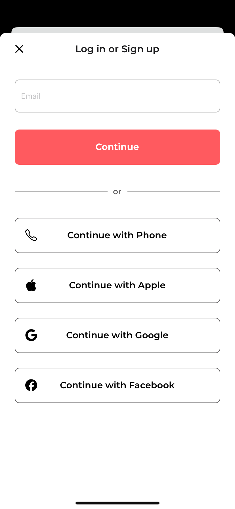</td>
        <td style="border: 1px solid black;">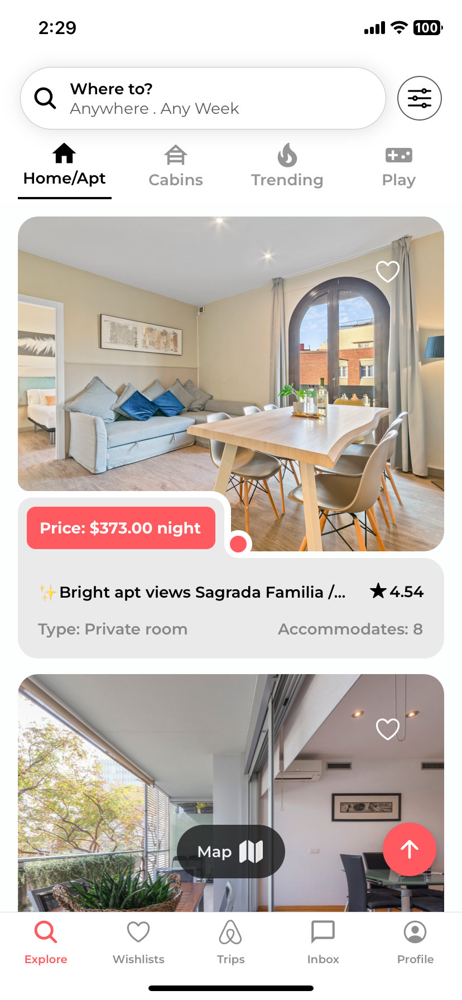</td>
        <td style="border: 1px solid black;">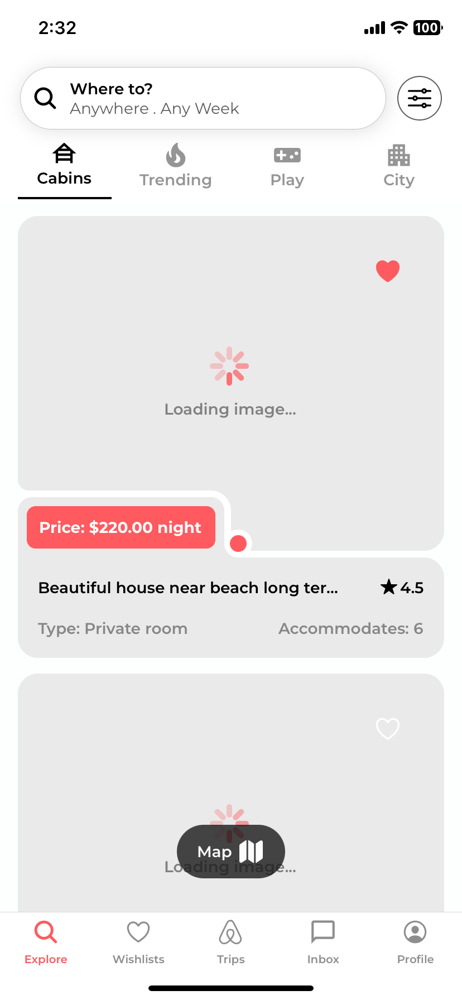</td>
        <td style="border: 1px solid black;">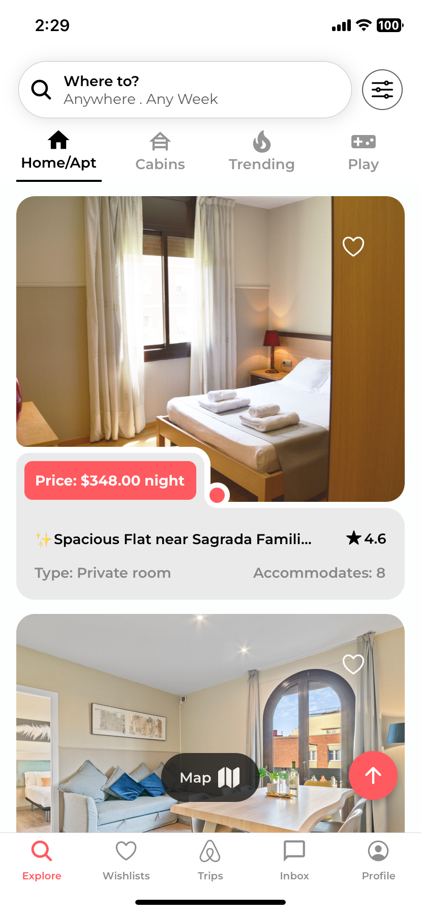</td>
      </tr>
      <tr>
       <td style="border: 1px solid black;">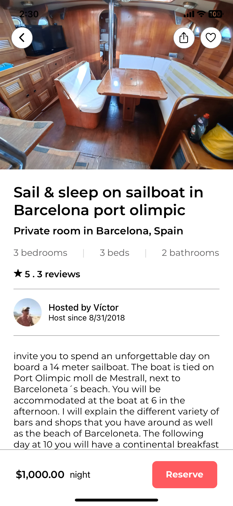</td>
       <td style="border: 1px solid black;">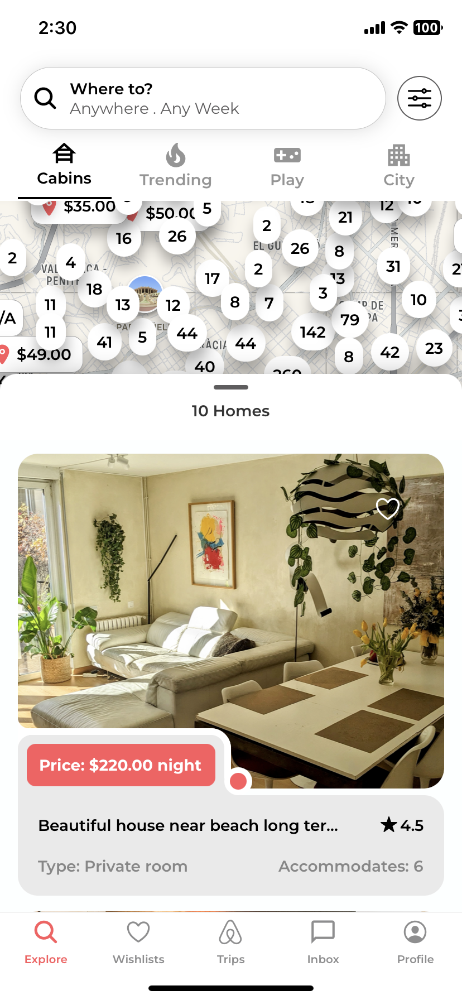</td>
       <td style="border: 1px solid black;">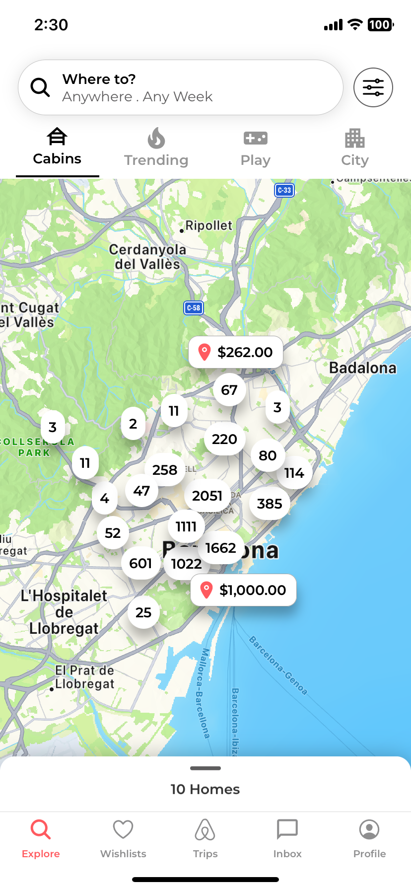</td>
       <td style="border: 1px solid black;">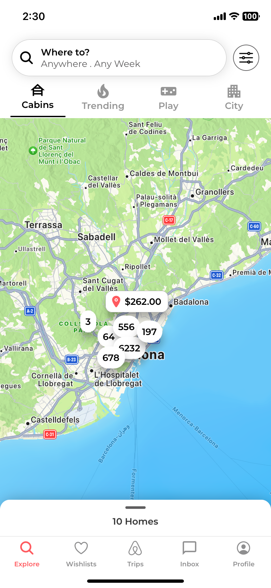</td>
      </tr>
      <tr>
       <td style="border: 1px solid black;">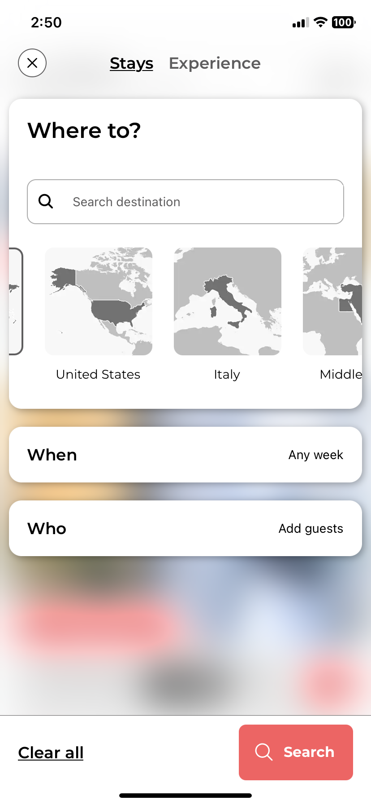</td>
       <td style="border: 1px solid black;">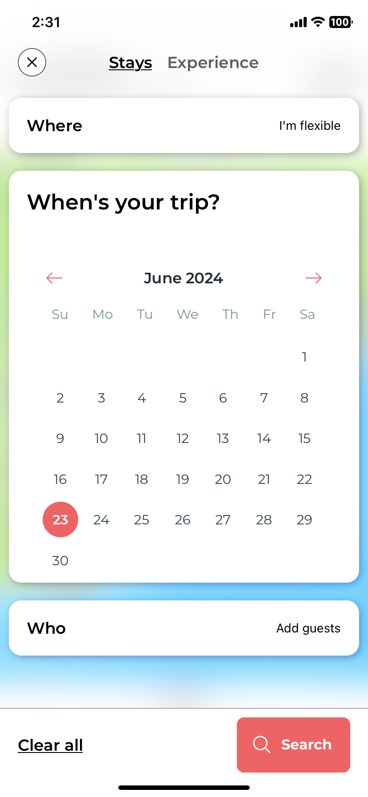</td>
       <td style="border: 1px solid black;">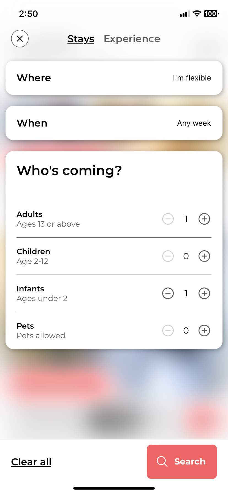</td>
       <td style="border: 1px solid black;">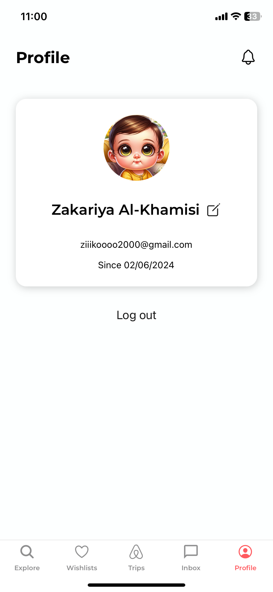</td>
      </tr>
      <!-- Add more rows as needed -->
    </tbody>
  </table>
</div>

## Technologies Used

- **React Native**: The primary framework used for building the mobile application.
- **Expo**: A toolchain built around React Native to facilitate development, building, and deployment.
- **Expo Router**: A library that provides routing capabilities for React Native applications.
- **Clerk**: A user authentication platform that provides secure and customizable authentication solutions.
- **Reanimated**: A React Native library used for creating smooth and performant animations.
- **React Native Maps**: A library that provides components for integrating maps into React Native applications.
- **React Native Map Clustering**: A library that enables map clustering to group nearby markers on a map.
- **Bottom Sheet**: A library that provides a bottom sheet component for React Native applications.
- **Expo Vector Icons**: A library that provides a set of customizable icons for use in React Native applications.

## Installation & Setup

To run the Airbnb Clone Expo React Native app, follow these steps:

1. Clone the repository:

   ```git
   git clone git@github.com:ZikaZaki/airbnb-mobile-app.git
   ```

2. Navigate to the project directory:

   ```cmd
   cd airbnb-mobile-app
   ```

3. Install the dependencies:

   ```npm
   npm install
   ```

   or

   ```yarn
   yarn install
   ```

4. Start the Expo development server:

   ```npx
   npx expo start
   ```

5. Follow the instructions provided in the Expo developer tools to run the app on your desired platform (e.g., iOS simulator, Android emulator, or physical device).

## Contributing

Contributions are welcome! Feel free to open an issue or submit a pull request if you have any improvements to the project.

## Acknowledgements

- [React Native](https://reactnative.dev/)
- [Expo](https://docs.expo.dev/)
- [Clerk](https://clerk.dev/)

## License

This project is licensed under the [MIT License](LICENSE).
